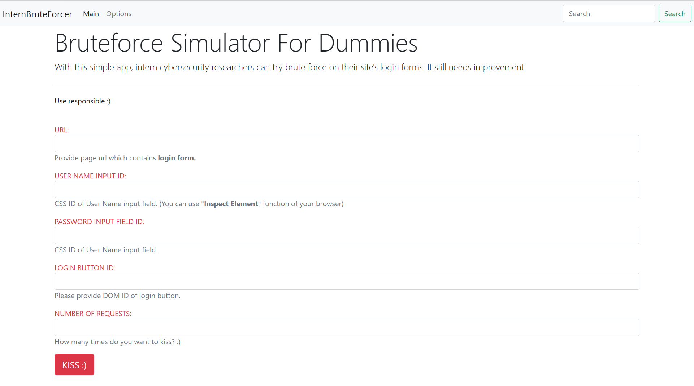

# InternBruteForcer

With this simple app, intern cybersecurity researchers can try brute force on their local environment ;). It still needs improvement. It uses OpenQA's Selenium for headless browser and .NET Core 3.1 Framework.

## Installation

Firstly,

` git clone git remote add origin https://github.com/eIektro/InternBruteForcer.git .

clone this repository to your PC with this command.

## Usage

Then go the directory and open .sln by Visual Studio or Jetbrains Rider

## Contributing

PR free

## License

MIT

## Screenshoot

